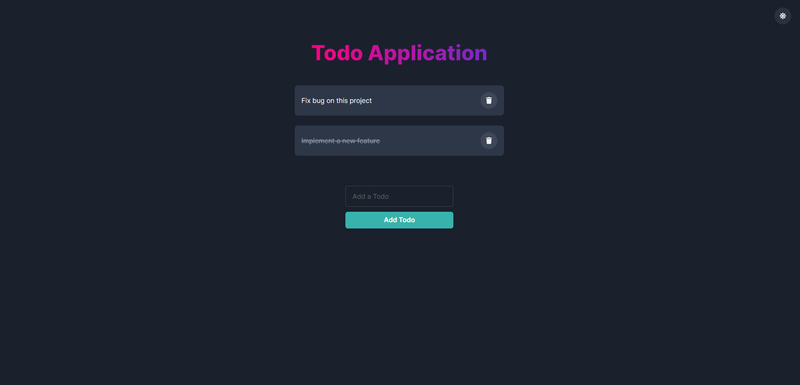
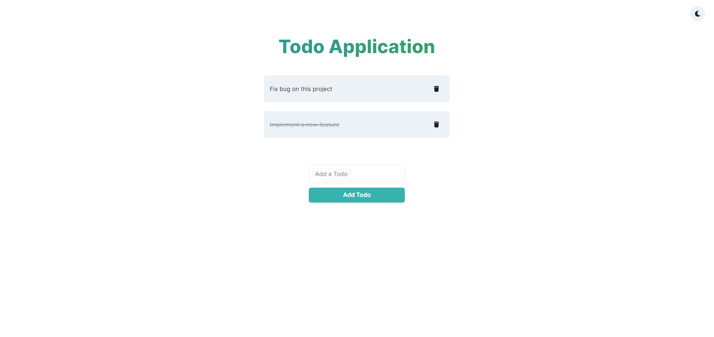

# React + Chakra UI Todo App

This is project is made using React Context Api and Localstorage.

# Screen Shots




# Clone the repo to local

```sh
# git clone this repository 🦑
git clone https://github.com/sadman-shami/react-chakra-todo-app.git
cd react-chakra-todo-app

# install dependencies
pnmp install
```

# Usage

The starter contains the following scripts:

### Pnpm

- `pnpm start` - start dev server 🚀
- `pnpm build` - build the project 📦
